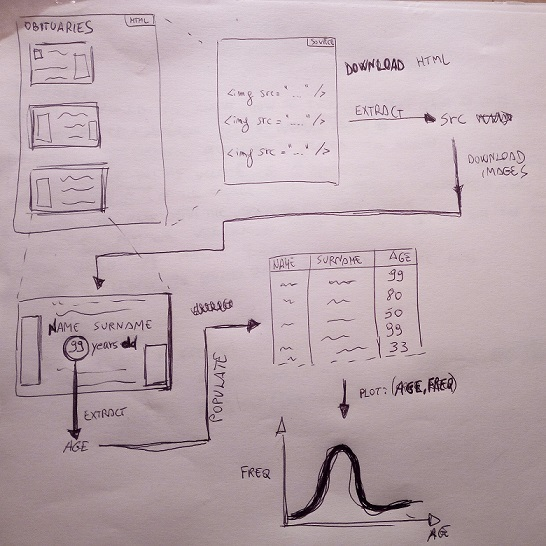

# Life Expectancy in San Cataldo, Sicily

## Project

## Installation

`npm install`

### Prerequisites

- [Google Tesseract OCR](https://github.com/tesseract-ocr/tesseract)

## Usage

`php main.php`

`python src/plot.py > output/plot.txt`

## Results [2018]

|       |     Age    |
|-------|:----------:|
| count | 335.000000 |
| mean  | 78.573134  |
| std   | 15.922526  |
| min   | 4.000000   |
| 25%   | 74.000000  |
| 50%   | 82.000000  |
| 75%   | 89.000000  |
| max   | 102.000000 |

![Results [2018]](_readme_files/2018-12-31_plot_age_freq.png)

### Tools

- [https://www.tablesgenerator.com/markdown_tables](https://www.tablesgenerator.com/markdown_tables)